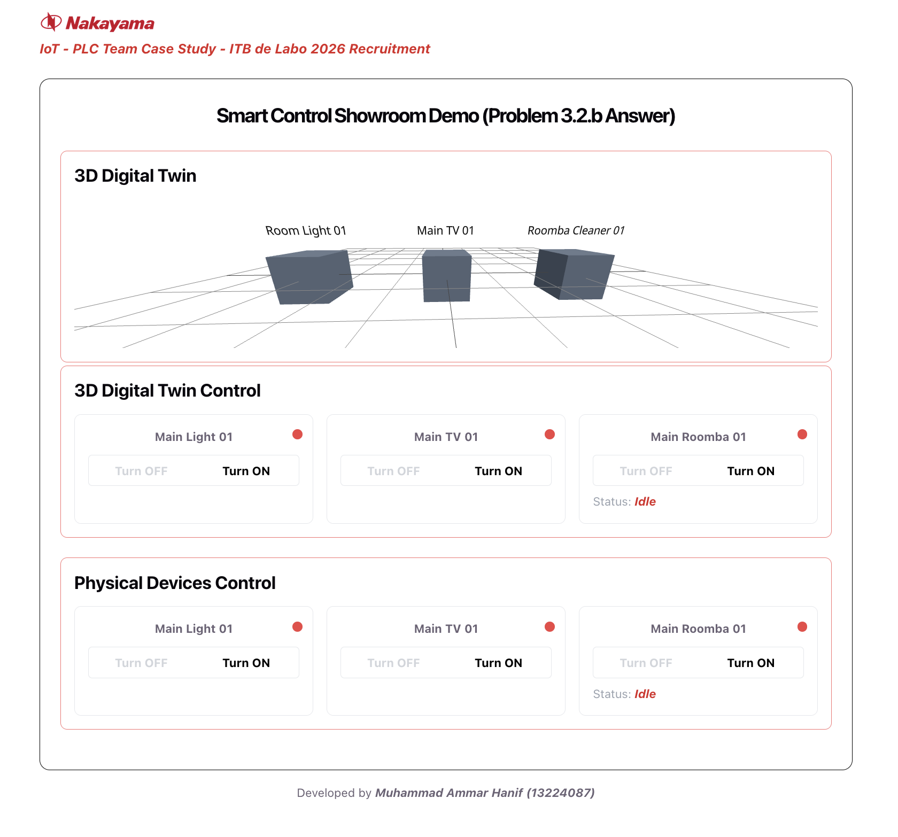
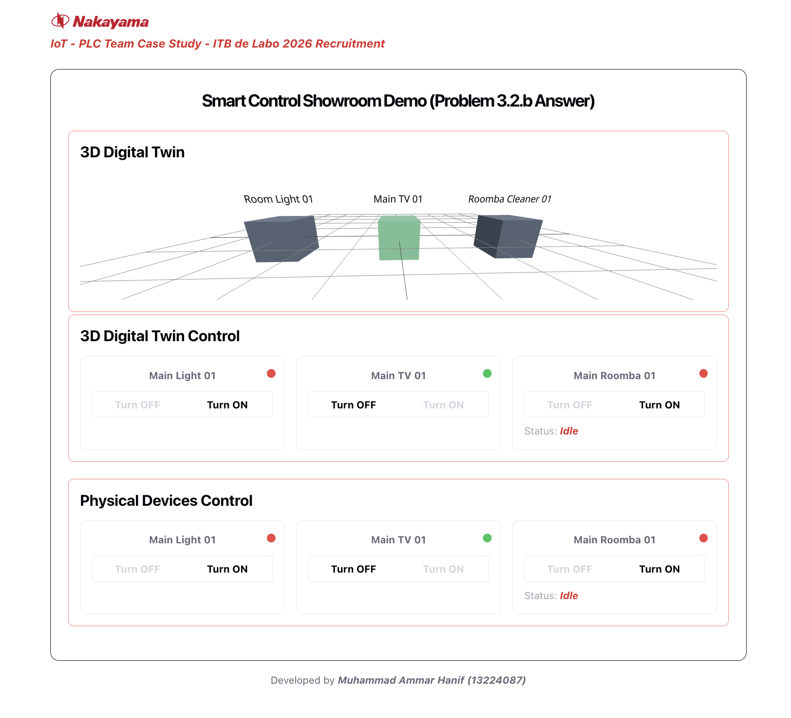
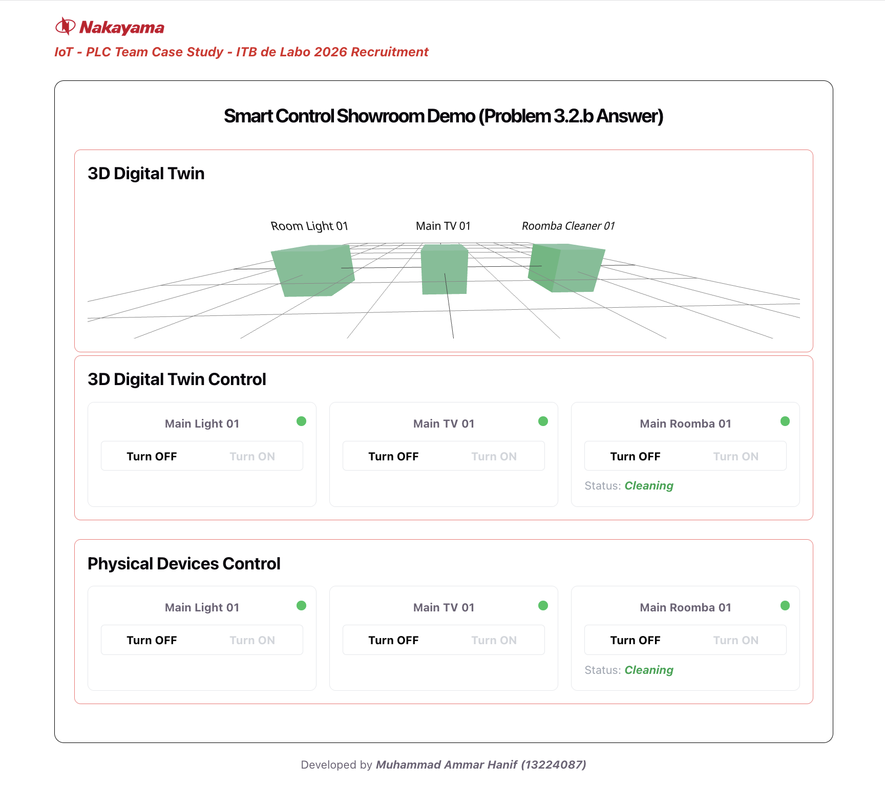

# Smart Control Showroom (Problem 3.2.b)

### IoT-PLC Team Case Study - ITB de Labo 2026 Recruitment

##### Developed by _Muhammad Ammar Hanif (13224087)_

## Overview

This project implements a device orchestration layer that abstracts multiple IoT communication protocols (Cloud API, Local API, MQTT) behind a single unified command interface, following a **Facade Design Pattern**. It includes a live-syncing Digital Twin dashboard demonstrating bidirectional state consistency between physical devices and their web app representation.

[Quick Demo Video (1:11 minute)](https://drive.google.com/file/d/1WueDMv9ddOkEfI_wK2lAnxorbtRPdTL1/view?usp=sharing)

## Solution Screenshot (Web App form)




---

## Project Structure

```
project-root/
├── backend/                        
│   ├── config/
│   │   ├── mongo.js                
│   │   ├── redis.js                
│   │   └── socket.js               
│   ├── models/
│   │   ├── deviceCompleteModel.js  
│   │   └── deviceStateModel.js     
│   ├── adapters/
│   │   ├── switchBotAdapter.js     
│   │   ├── natureRemoAdapter.js    
│   │   └── roombaAdapter.js        
│   ├── services/
│   │   ├── commandRouter.js        
│   │   ├── statePoller.js          
│   │   └── mqttSubscriber.js       
│   ├── controllers/
│   │   ├── deviceController.js     
│   │   └── webhookController.js    
│   ├── routes/
│   │   ├── deviceRoutes.js
│   │   └── webhookRoutes.js
│   ├── seedDatabase.js             
│   ├── server.js                   
│   └── package.json
│
└── client/                         # Frontend (React + r3f + Vite + Tailwind CSS)
    ├── public/
    │   └── Nakayama_Logo.png
    |   ├── .... (png files)
    ├── src/
    │   ├── components/
    │   │   ├── DeviceCard.jsx
    |   |   ├── StatusDot.jsx   
    │   │   └── Scene3D.jsx         # NEW, a minimal r3f 3D Digital Twin (suplement to answer 3.2.b)
    │   ├── hooks/
    │   │   └── useDeviceSocket.js  
    │   ├── App.jsx                 # UPDATED, add the 3D Digital Twin section
    │   ├── main.jsx
    │   └── index.css
    ├── index.html
    ├── tailwind.config.js
    ├── postcss.config.js
    └── package.json
```

---

## System Design

**Pattern used:** Facade Design Pattern

- **Client:** React dashboard, only use one endpoint (`POST /api/devices/command`)
- **Facade:** `commandRouter.js`, a single entry point that inspects a device's registered protocol and delegates to the matching adapter
- **Subsystem classes:** `switchBotAdapter.js`, `natureRemoAdapter.js`, `roombaAdapter.js`. Each of the file is isolated, unaware of the router or each other, and each of it is responsible to only translating generic commands into vendor-specific calls

Adding a new device type requires only a new adapter file, so no changes to the router, controller, or frontend.

**Database split:**

| Database | Purpose | Data (Example) |
|---|---|---|
| MongoDB | Static, rarely-changing metadata | Device registry, credentials, protocol type, GLB digital twin mapping |
| Redis | Live, frequently-changing state | Current power/temp/status per device, with real-time pub/sub |

**Real-time sync layer:** Redis keyspace notifications -> Socket.IO server -> all connected dashboard clients, so every state change (regardless of source) reaches every open browser session simultaneously.

<!-- **One-time Redis Keyspace Notifications** 
```bash
# run this in the terminal
redis-cli config set notify-keyspace-events KEA
``` -->

---

## Data Pipeline

### Flow 1 : Web App (Dashboard) -> Physical Device

1. User clicks a control (e.g. "Turn ON") on the React dashboard
2. Frontend sends `POST /api/devices/command` with `{ deviceID, command, currentState }`
3. `deviceController.js` receives the request, calls `commandRouter.js`
4. `commandRouter.js` looks up the device's protocol in MongoDB
5. Router delegates to the matching adapter (`switchBotAdapter` / `natureRemoAdapter` / `roombaAdapter`)
6. Adapter executes the vendor-specific command against the physical device
7. On success, the new state is written to Redis
8. Redis fires a keyspace notification on that key change
9. `socket.js` listener catches the notification, reads the updated value, and send the newest update of the Redis data via Socket.IO
10. Every connected browser session (physical device card + digital twin card) receives the event and updates its UI simultaneously

### Flow 2 : Physical Device -> Web App (Dashboard)

This covers the case where a device's real state changes independently, keeping the Digital Twin accurate all the times. For this demonstration, this flow is triggered via the Physical Devices Control (Simulator) interface.

**For MQTT devices (Roomba):**
1. A physical change is simulated by clicking a control on the frontend Simulator.
2. Frontend sends POST `/api/webhooks/simulate` with `{ deviceID, state }`.
3. The webhook controller acts as the physical hardware and publishes a real MQTT payload to a unique topic (example: `nakayama/roomba/{deviceID}/state`) on the public test broker.
4. `mqttSubscriber.js`, which maintains a persistent connection to that same broker, receives the published message.
5. The subscriber parses the hardware payload, merges it with any unchanged state data, and writes the new state to Redis.
6. Redis fires a keyspace notification on that key change (key process to making sure the Digital Twin is always updated).
7. `socket.js` listener catches the notification, reads the updated value, and send the newest update of the Redis data via Socket.IO.
8. Every connected browser session receives the event and updates its 3D Digital Twin simultaneously.

**For Cloud API / Local API devices (SwitchBot / Nature Remo):**
1. A physical change is simulated by clicking a control on the frontend Simulator.
2. Frontend sends POST `/api/webhooks/simulate` with `{ deviceID, state }`.
3. The webhook controller acts as an incoming webhook push from the vendor, bypassing external routing and directly writing the new state to Redis.
4. Redis fires a keyspace notification on that key change.
5. `socket.js` listener catches the notification, reads the updated value, and send the newest update of the Redis data via Socket.IO.
6. Every connected browser session receives the event and updates its 3D Digital Twin simultaneously.

### Backend State Reflected in 3D Scene
`Scene3D.jsx` renders the given .glb file. The objects that we are able to control are the light (Main_Light_01), TV (Main_TV_01), and Roomba (Main_Roomba_01), each subscribed to the same states object already provided by `useDeviceSocket.js`. This component consumes the exact same `deviceStateChanged` event already explained in **Flow 1** and **Flow 2** above.

- When `power: "on"`: the corresponding box's material switches to green color.
- When `power: "off"`: the box reverts to a plain gray color.

`OrbitControls` lets the operator (or user in the web app dashboard) pan/zoom/rotate around the scene.
